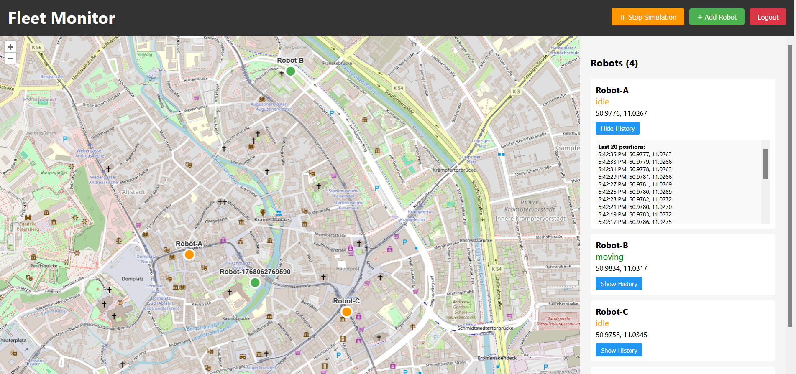
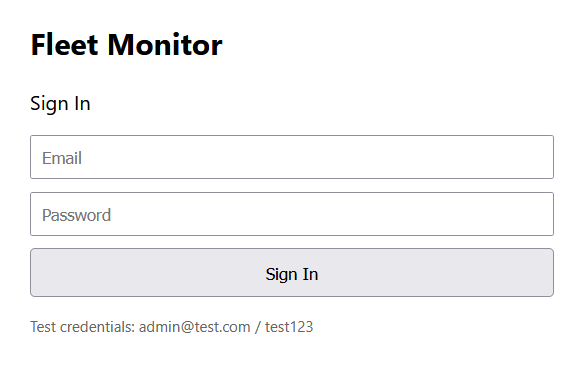

# Mini-Fleet Monitor

Full-Stack-Webanwendung zur Überwachung virtueller Roboter mit Live-Positionsupdates auf einer OpenLayers-Karte.



## 🛠 Tech-Stack

**Backend:** Node.js, Express, PostgreSQL, Redis, JWT, Socket.IO  
**Frontend:** React, OpenLayers  
**Deployment:** Docker Compose

---

## 🚀 Quick Start

### 1. Backend starten

```bash
docker-compose up -d --build
```

Services:

- `api` (Port 3002)
- `db` (PostgreSQL, Port 5432)
- `redis` (Port 6379)

### 2. Frontend starten

```bash
cd frontend
npm install
npm start
```

**Verfügbar unter:** `http://localhost:3001`

---

## 🧪 Login

```
Email:    admin@test.com
Passwort: test123
```

---

## 📊 Datenmodell

| Tabelle           | Spalten                                         |
| ----------------- | ----------------------------------------------- |
| `users`           | id, email, password, role, created_at           |
| `robots`          | id, name, status, lat, lon, battery, updated_at |
| `robot_positions` | id, robot_id, lat, lon, recorded_at             |

---

## 🔌 API-Endpunkte

| Methode | Pfad                  | Beschreibung                                 |
| ------- | --------------------- | -------------------------------------------- |
| `POST`  | `/auth/login`         | Login (Email/Passwort → JWT)                 |
| `GET`   | `/robots`             | Alle Roboter (auth-geschützt, Redis-gecacht) |
| `POST`  | `/robots`             | Neuen Roboter erstellen                      |
| `GET`   | `/robots/:id/history` | Positionshistorie (letzte 20)                |
| `POST`  | `/simulation/toggle`  | Simulation pausieren/starten                 |

---

## ⚙️ Features

- ✅ **JWT-Auth** – Sichere API-Routen
- ✅ **WebSocket (Socket.IO)** – Live-Position-Updates
- ✅ **Redis-Caching** – GET /robots (TTL 10s)
- ✅ **Positionshistorie** – Alle Bewegungen gespeichert
- ✅ **Start/Stop Simulation** – Button im Frontend
- ✅ **Roboter-Management** – Add/Move/History
- ✅ **OpenLayers-Karte** – Interaktive Kartendarstellung

---

## 📸 Screenshots

### Login



### Dashboard mit Karte


---

## 📁 Projektstruktur

```
Mini-Fleet-Monitor/
├── backend/
│   ├── config/db.js
│   ├── routes/auth.js
│   ├── routes/robots.js
│   ├── middleware/auth.js
│   ├── simulation.js
│   └── server.js
├── frontend/
│   ├── src/components/
│   │   ├── Login.js
│   │   ├── Dashboard.js
│   │   └── Map.js
│   └── package.json
├── docker-compose.yml
└── README.md
```

---

## 🐳 Docker

```bash
# Logs anzeigen
docker-compose logs -f api

# PostgreSQL öffnen
docker-compose exec db psql -U postgres -d fleetmonitor

# Alles stoppen + Datenbank zurücksetzen
docker-compose down -v
```

---

## 🎁 Bonus-Features

- Redis Pub/Sub für Live-Updates
- Positionshistorie pro Roboter (letzte 20)
- Start/Stop-Button für Simulation
- Roboter hinzufügen/verwalten
- History-Button pro Roboter

---

**Made with ❤️ – January 2026**
